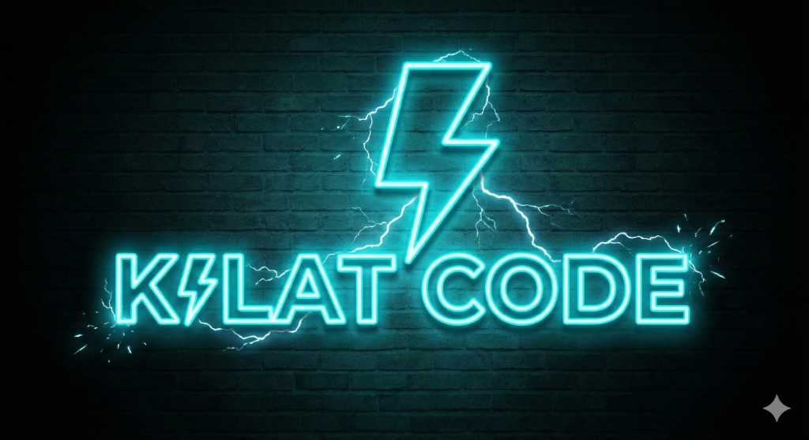

# GlobalViral App
<p align="center">
  
</p>

**Repurpose YouTube videos into viral TikTok/Reels/Shorts clips with AI-powered automation.**

---

## ✨ Features

### 🎬 Viral Clipper Tab
- Download and process YouTube videos
- Automatic clip extraction based on engagement detection
- Video filters with 10 genre-matched combinations
- Caption styles: Karaoke, Bounce, Fade, and more

### ✨ AI Animator Tab
- AI-generated animations from transcripts
- 10 genre templates (Documentary, Horror, Comedy, etc.)
- 10 art styles (Ghibli Anime, Realistic, Vintage, etc.)
- 5-Part Cold Open structure for viral storytelling
- 2.5D parallax animation effects
- Multi-language support (Indonesian, English)
- Edge-TTS dubbing with multiple voices

### 🎭 Character Edit Tab
- Face-based highlight reel generation
- Character detection and tracking
- Automatic scene compilation

---

## 🚀 Installation

### Requirements
- Python 3.10+
- FFmpeg (bundled in `bin/`)
- Windows 10/11

### Setup
```bash
# Clone repository
git clone https://github.com/yourusername/globalviral-clipper.git
cd globalviral-clipper

# Install dependencies
pip install -r requirements.txt

# Run application
python main.py
```

### Build EXE
```bash
python build_installer.py
```
Output: `dist/KilatCodeClipper.exe`

---

## 🔑 API Keys Required

Configure in **API Settings** tab:

| API | Purpose | Required |
|-----|---------|----------|
| Groq | Transcription | ✅ Yes |
| Gemini | Story generation | Optional (falls back to Groq) |
| Pollinations (Primary) | Image generation | Optional (Prodia fallback available) |

**Free APIs (no key needed):**
- Pollinations.ai - Image generation
- Edge-TTS - Text-to-speech

---

## 📁 Project Structure

```
Global-Viral-App/
├── main.py              # Main app + UI (Gradio)
├── animator_v2.py       # AI Animator engine
├── character_edit.py    # Character Edit engine
├── license.py           # License management
├── build_installer.py   # PyInstaller build script
├── requirements.txt     # Python dependencies
├── bin/                 # Bundled FFmpeg
├── sfx/                 # Sound effects
├── assets/              # UI assets
```

---

## 🎯 Usage

1. **Launch**: Run `python main.py` or `KilatCodeClipper.exe`
2. **Select Tab**: Choose Viral Clipper, AI Animator, or Character Edit
3. **Input**: Paste YouTube URL or upload local video
4. **Configure**: Select genre, style, voice, filter
5. **Generate**: Click process button and wait
6. **Export**: Download generated video

---

## ⚠️ Important Notes

- **Antivirus**: Add exception for Python if image generation fails
- **FFmpeg**: Make sure `bin/ffmpeg.exe` exists
- **Internet**: Required for API calls and YouTube downloads

---

## 📄 License

Proprietary - License key required for activation.

---

██╗  ██╗██╗██╗      █████╗ ████████╗ ██████╗ ██████╗ ██████╗ ███████╗
██║ ██╔╝██║██║     ██╔══██╗╚══██╔══╝██╔════╝██╔═══██╗██╔══██╗██╔════╝
█████╔╝ ██║██║     ███████║   ██║   ██║     ██║   ██║██║  ██║█████╗  
██╔═██╗ ██║██║     ██╔══██║   ██║   ██║     ██║   ██║██║  ██║██╔══╝  
██║  ██╗██║███████╗██║  ██║   ██║   ╚██████╗╚██████╔╝██████╔╝███████╗
╚═╝  ╚═╝╚═╝╚══════╝╚═╝  ╚═╝   ╚═╝    ╚═════╝ ╚═════╝ ╚═════╝ ╚══════╝
                                                                        
🚀 Handcrafted by KilatCode Studio
Copyright © 2025 KilatCode. All rights reserved.

**Made with ❤️ for content creators**
